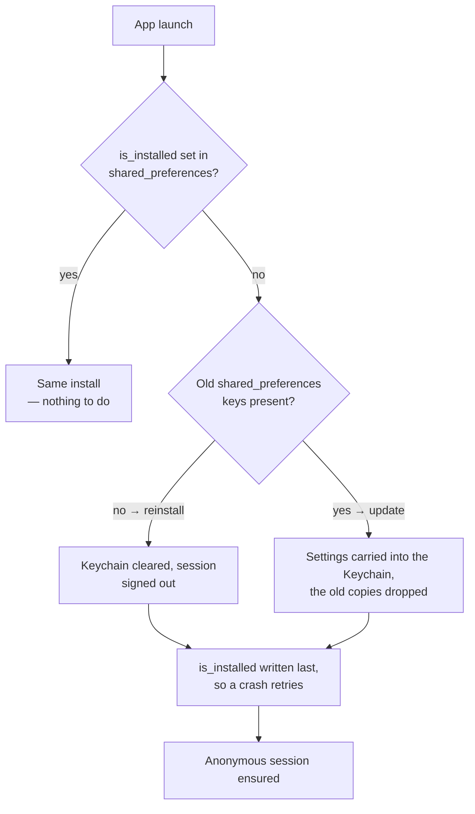
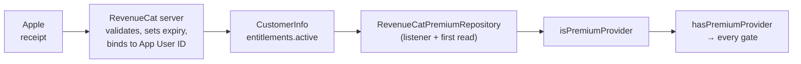
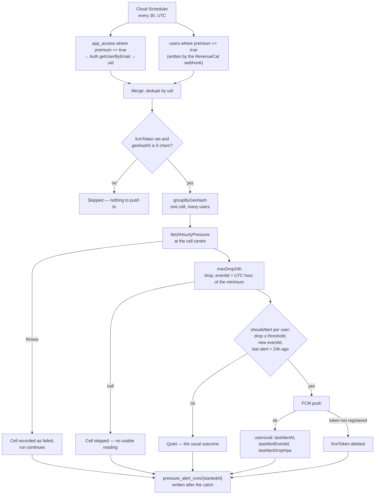

# BaroEase

An iOS-first Flutter app for tracking migraines and barometric-pressure risk.
It works offline, uses dark mode by default and supports seven languages.

| Document | Use it for |
|---|---|
| [`PLAN.md`](PLAN.md) | Product scope and architecture |
| [`AGENTS.md`](AGENTS.md) | Repository rules and document routing |
| [`docs/README.md`](docs/README.md) | Documentation index |
| [`docs/DONE_WORK.md`](docs/DONE_WORK.md) | What is built |
| [`docs/REMAINING_WORK.md`](docs/REMAINING_WORK.md) | What still blocks release |

## Requirements

| Tool | Requirement |
|---|---|
| Flutter | Stable, Dart 3 |
| Melos | `6.3.3` |
| Xcode | iOS build and signing |
| Ruby 3.x + Bundler | Fastlane release only |
| JDK 11+ | Firebase emulator only |

## Setup

```bash
git clone --recurse-submodules <url>
cd migraine_tracker
dart pub global activate melos 6.3.3
melos run set-up
```

`--recurse-submodules` is not optional. Every Melos script lives in
`packages/system_design/tool/`, inside the design-system submodule, so a clone
without it has no `set-up.sh` to run — recover with `git submodule update --init
--recursive`.

`set-up` restores submodules, dependencies, generated code and native setup. It
also creates missing key-only files from `env/*.example.json`.

Real configuration is gitignored. Put local source files in `env_assets/`, then
install one environment:

```bash
sh packages/system_design/tool/prepare-env.sh dev
# or
sh packages/system_design/tool/prepare-env.sh prod
```

A release does this itself, so this is only for switching a checkout by hand.

Never print or commit files from `env/`, `env_assets/`,
`ios/Flutter/Generated.xcconfig` or native Firebase configuration.

## Commands

Melos carries eight commands, and they are the ones a human types.

| Command | Purpose |
|---|---|
| `melos run set-up` | Clean and restore a normal checkout |
| `melos run deep-set-up` | Also clear Xcode DerivedData |
| `melos run release-dev` | Full dev release: set up, config, checks, deploy, TestFlight |
| `melos run release-prod` | The same against production |
| `melos run deploy-firebase-dev` | Rules, indexes and functions to dev |
| `melos run deploy-firebase-prod` | The same against production |
| `melos run upload-ipa-dev` | Re-upload the built IPA when only the upload failed |
| `melos run upload-ipa-prod` | The same against production |

Everything else is a script in `packages/system_design/tool/`, run by the
command that needs it or by hand.

| Script | Purpose |
|---|---|
| `sh packages/system_design/tool/gen.sh` | Generate localization and Drift code |
| `sh packages/system_design/tool/analyze.sh` | The CI analyzer, zero findings allowed |
| `sh packages/system_design/tool/test.sh` | The full test suite |
| `sh packages/system_design/tool/prepare-env.sh <dev\|prod>` | Install one environment's configuration |
| `sh packages/system_design/tool/build-ipa.sh <dev\|prod>` | Build the IPA and nothing else |
| `flutter run --dart-define-from-file=env/dev.json` | Run the development app |

Run only tests related to the change:

```bash
flutter test test/features/<feature>/<test_file>_test.dart
```

Do not use the full test suite as change verification.

## Release

One command per environment, four steps: set up, install that environment's
configuration, deploy its Firebase side, then build and upload to TestFlight.

```sh
melos run release-dev
```

```sh
melos run release-prod
```

The Firebase deploy still names the project and asks before it runs, and the
build number is bumped in `pubspec.yaml` — commit it after the upload.

If the build succeeded and only the upload failed, re-send the IPA already on
disk instead of building again:

```sh
melos run upload-ipa-dev
```

See [`docs/release/PIPELINE.md`](docs/release/PIPELINE.md) for the flow and
[`docs/release/CREDENTIALS.md`](docs/release/CREDENTIALS.md) for required keys.

## Project map

| Path | Ownership |
|---|---|
| `lib/core/` | Cross-cutting infrastructure only |
| `lib/features/` | Feature-based app code |
| `lib/l10n/` | Seven ARB localization files |
| `functions/` | Firebase Cloud Functions |
| `packages/system_design/` | Design-system git submodule |
| `test/features/` | Tests mirroring app features |
| `packages/system_design/tool/` | Scripts called by Melos |

Dependencies inside a feature point `presentation → domain ← data`. Across
features, import only `domain/` or `providers.dart`.

## App identifiers

| Target | Identifier |
|---|---|
| iOS app | `app.dd.migraine.tracker` |
| iOS widget | `app.dd.migraine.tracker.BaroEaseWidgetExtension` |
| iOS App Group | `group.app.dd.migraine.tracker` |
| Android app | `com.dd.migraine.tracker` |

The iOS and Android identifiers intentionally differ. Do not normalize them.

## Core behavior

| Area | Rule |
|---|---|
| Storage | Drift on-device is the source of truth |
| Settings | Keychain via `SecureStore`; deleting the app and reinstalling starts clean |
| Attack log | Fully usable offline; weather is best-effort |
| Account | Optional; Google/Apple upgrades the anonymous UID |
| Sync | AES-GCM encrypted, server-assisted, not end-to-end encrypted |
| Weather | WeatherKit is called only by Cloud Functions |
| Premium | RevenueCat entitlement is the only access source |
| Theme | Dark mode is the default; no pure-white or flashing UI |

## First launch, reinstall, and what a delete takes with it

iOS deletes the app's container when the app is deleted, but not its Keychain.
`FreshInstallGuard` (`core/storage/`) is what makes a reinstall look like a
first install anyway.

| Deleted with the app | Survives the delete |
|---|---|
| The Drift database — attacks, medications, reminders | The Firebase session (Keychain) |
| `shared_preferences`, which is why the `is_installed` flag lives there | Every `SecureStore` value (Keychain) |
| RevenueCat's anonymous id (`NSUserDefaults`) | The App Store subscription itself, on the Apple ID |



- **Only a reinstall signs out.** An update deleted nothing, so it keeps both
  its session and its settings — the settings just move into the Keychain.
- **The sign-out is the point of the reinstall branch**: the Firebase session is
  the one thing the Keychain carries across a delete.
- **Signed-in data comes back on its own.** The local database is gone, but the
  first sync after signing in pulls the account's attacks down again; that is
  the sync working, not the delete failing.
- **The guard never throws.** A cleanup that fails must not take the launch with
  it — every branch logs under the `Storage` tag.

## Premium identity

Premium is an entitlement RevenueCat holds against the current **App User ID**.
The app stores no premium flag of its own, on device or in Firestore.



| Session | App User ID | Set by |
|---|---|---|
| Anonymous | `$RCAnonymousID:…`, kept inside the install | The SDK, on first launch |
| Signed in | The Firebase UID | `Purchases.logIn(uid)`, from the auth listener |
| Signed out again | A new, empty anonymous ID | `Purchases.logOut()` |

| Situation | What the user gets |
|---|---|
| Buys while anonymous | Premium on that install only |
| Signs in after buying anonymously | The purchase transfers onto the account |
| Signed-in purchase, second device | Sign in — premium appears, no Restore tap |
| Anonymous purchase, second device | Restore only, and only on the same Apple ID |
| Signs out | Premium goes away on that device until sign-in or Restore |
| Signs out, signs in as another account | The other account gets nothing; premium stays on the first |
| Reinstalls while anonymous | The anonymous ID is gone; Restore is the only way back |

Restoring a receipt that another App User ID already owns is decided by
RevenueCat's project-level **Restore Behavior** setting, not by this app:
*Transfer to new App User ID* moves premium and strips it from the first
account, *Keep with original* fails as `PurchaseError.alreadyOwned`.

Two things sit outside the chain: an address in the `app_access` collection is
premium ahead of any entitlement (the App Review account, the owner's own), and
no account is ever required to buy, restore or use premium (App Store
5.1.1(v)).

Numbers and gates: [`docs/PREMIUM_RULES.md`](docs/PREMIUM_RULES.md). Surface
behavior: [`lib/features/premium/CLAUDE.md`](lib/features/premium/CLAUDE.md).

## The pressure alert cron

`pressureAlertJob` (`functions/src/index.ts:64`) runs every 3 hours on Cloud
Scheduler, UTC, in `europe-west1`. One run resolves who is eligible, spends one
WeatherKit call per geohash cell, pushes to the users whose own threshold is
crossed, and writes down what it did.



| Step | What it does | Where |
|---|---|---|
| Audience | Premium subscribers plus the `app_access` allow-list, deduped by uid | `index.ts` `runAlertPass` |
| Eligibility | Needs an `fcmToken` and a 5-character `geohash5`; threshold is `alertThreshold`, default 5 hPa | `index.ts` `runAlertPass` |
| Grouping | One forecast call per cell, never per user (hard rule 10) | `core/grouping.ts` |
| Forecast | Hourly pressure at the cell centre, from WeatherKit | `weather/weatherKit.ts` |
| Drop | Nearest hour to now is the current reading; the minimum within 24h is the event | `core/pressure.ts` `maxDrop24h` |
| Dedupe | Drop ≥ threshold, `eventId` not already sent, and no push in the last 24h | `core/alerts.ts` `shouldAlert` |
| Push | FCM notification plus a data payload the app localizes itself | `index.ts` `sendPush` |
| History | One document per run, `ok` / `partial` / `failed` | `core/alertRunRecord.ts` |

- **The allow-list is resolved through Auth, not a Firestore query.** Auth
  lower-cases an address and answers for an account that has no `users` doc yet;
  a Firestore `==` on an email does neither.
- **A failure is contained to its own cell or user.** A cell whose forecast
  throws is recorded and the run moves on; a push that fails is logged, and only
  a stale token (`messaging/registration-token-not-registered`) changes the user
  document — by deleting the token.
- **The history write sits outside the try/catch.** A run that threw is the run
  the record is most needed for, so `runAlertPass` is split out and the document
  is written either way.
- **The job still throws at the end** when the pass threw or any cell failed, so
  the scheduler sees a failed run — the record is written first.
- **The push carries English text and the numbers.** The app renders its own
  localized row from the `data` payload; only `dropHpa`, `eventId` and `at`
  actually travel.
