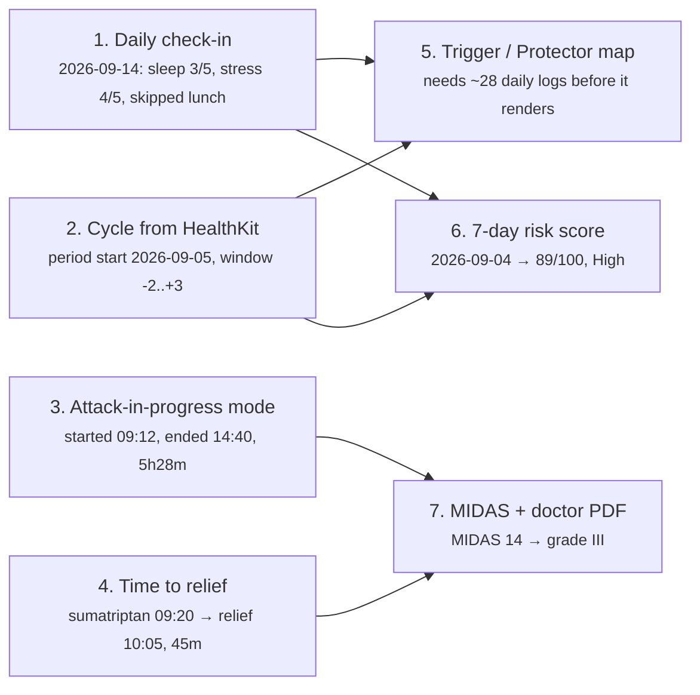

# Roadmap after v1.0

Authority for what BaroEase builds next and in which order. Written 2026-09-02
from a market survey of the apps listed below. `PLAN.md` stays the authority for
current scope; this file is the queue behind it. Nothing here is built yet — a
gate only becomes real in [`PREMIUM_RULES.md`](PREMIUM_RULES.md) the release it
ships.

## What the market has that v1.0 does not

| App | The one thing it does better | Evidence |
|---|---|---|
| N1-Headache | Trigger / Protector / No-association maps from a **daily** diary, menstruation diary, monthly disability score | n1-headache.com |
| Bearable | 30-second daily check-in, "Impacts" view of which factor helps or hurts | bearable.app |
| Claru | 7-day personal risk score, "migraine mode" during an attack | claruapp.com |
| Migraine Buddy | Trigger/symptom library, specialist-written doctor report | apps.apple.com/us/app/id975074413 |
| Migraine Trail | Voice logging, weather risk up to 24h ahead | migrainetrail.com |
| WeatherX | 5-day pressure forecast **and** 5-day history, a notification 1h before the shift | apps.apple.com/us/app/id1125533216 |
| Pressure Pal | Attacks drawn on the hourly pressure curve, 7-day outlook flagging risky days | pressurepal.app |

The gap behind most of those rows is one thing: **v1.0 records only days that
hurt.** A correlation computed from attacks alone has no control group, so it can
say "12 of your attacks followed a 6 hPa drop" but never "and 40 quiet days
followed one too". Wave 1 exists to create that control group; Waves 2 and 3
spend it.

## Waves

| Wave | Theme | Items |
|---|---|---|
| v1.1 | Record more than the attack | 1–4 |
| v1.2 | Insight worth paying for | 5–8 |
| v1.3 | Warning quality and reach | 9–12 |

## Wave v1.1 status, 2026-09-03

| # | Feature | State |
|---:|---|---|
| 1 | Daily check-in | **Shipped** — `lib/features/daily_log/`, schema v17, fifth synced collection |
| 2 | Menstrual cycle | **Shipped** — owner approved the `health` 3.0.6 → 13.3.1 upgrade. Read-only, on-device, its own switch on the check-in, window -2..+3 around HealthKit's own period-start marker |
| 3 | Attack in progress | **Shipped** — `AttackNowScreen`, the dashboard card, `Attack.isRunningAt`, and the Live Activity through the `live_activities` package. The native half is **unbuilt and unverified** — `docs/rules/PENDING_SETUP.md` lists what to check on the first real device |
| 4 | Time to relief | **Shipped** — `medicationTakenAt` + `reliefAt`, schema v18, `MedicationTimingSheet` |

Wave 1 is complete in code. Wave 2's risk score can read the cycle through
`todayCycleDayProvider` as it stands, and the trigger map has
`answeredDailyLogCountProvider` for its own gate.

## Wave v1.1 — record more than the attack

| # | Feature | Free | Premium |
|---:|---|---|---|
| 1 | Daily check-in: sleep quality, stress, skipped meal, caffeine, alcohol, screen hours; sleep and steps pre-filled from HealthKit | Log every day, last 30 days visible | Full history |
| 2 | Menstrual cycle read from HealthKit, shown on the history calendar | Shown | Used in every analysis |
| 3 | Attack-in-progress mode: running timer, lowest-light screen, one tap for "took medication" and "it stopped", iOS Live Activity | Yes | Yes |
| 4 | Time to relief: medication taken at, relief felt at | Recorded | Charted |

| Concern | Direction |
|---|---|
| Data model | New feature `lib/features/daily_log/`, Drift table `daily_logs` keyed by local date; one schema bump covers items 1, 2 and 4 |
| Cycle storage | On-device only, never in a sync payload — see [`rules/DECISIONS.md`](rules/DECISIONS.md) |
| Check-in cost | Must stay under 30 seconds and one screen, or the control group never fills |
| Reminder | Reuse the notification feature; the check-in nudge counts against the free reminder limit only if the user sets a custom time |
| Live Activity | Extends the existing App Group bridge in `home_widget`; no second bridge |
| Localization | Every new string lands in all seven ARB files the same turn |

Done when a user who never logs an attack still produces one `daily_logs` row a
day, and the row survives a sync round trip on a second device.

## Wave v1.2 — insight worth paying for

| # | Feature | Tier | Note |
|---:|---|---|---|
| 5 | Trigger / Protector / Not-associated map over every logged factor | Premium | Needs ≥15 attacks *and* ≥28 daily logs; below that, show progress, not an empty screen |
| 6 | 7-day risk score with its reasons spelled out | Premium | Rule-based, not machine-learned — see below |
| 7 | Monthly MIDAS questionnaire, carried into the doctor PDF | Premium | MIDAS only; HIT-6 is licensed |
| 8 | Attacks drawn on the hourly pressure curve | Premium | Extends `pressure_timeline_builder` |

### The risk score

Deterministic weights over signals the app already holds, each shown with the reason
that produced it. No model, no training, no cloud inference: the user must be
able to read why today scored what it scored.

| Signal | Points | Worked example, 2026-09-04 |
|---|---:|---|
| Forecast pressure drop in the next 24h, against the user's own threshold | 0–40 | 1013.2 → 1006.4 hPa, drop 6.8 of a 8.0 threshold → 34 |
| Cycle window, day −2 to +3 of the period | 0–25 | period starts 2026-09-05, today is day −1 → 25 |
| Sleep debt against the personal baseline | 0–20 | baseline 7h10m, last night 5h20m, debt 1h50m → 18 |
| Attacks in the last 7 days against the personal median | 0–15 | 3 against a median of 1 → 12 |
| **Total** | **0–100** | **89 → High** |

Bands: 0–29 Low, 30–59 Moderate, 60–100 High. The card stays hidden until the
score has all four inputs for at least 14 days; a partial score is graded and
labelled, never silently weighted differently.

## Wave v1.3 — warning quality and reach

| # | Feature | Tier | Note |
|---:|---|---|---|
| 9 | 5–7 day pressure outlook and 5-day pressure history | Premium | Recost the WeatherKit quota before starting; the cron already groups by geohash |
| 10 | A notification 1h before the drop starts, plus an optional morning outlook | Premium | Keeps the existing dedupe: 3 alerts a day, 8h apart, silent at local night |
| 11 | Humidity, temperature swing and storm fronts as additional triggers | Premium | `PLAN.md` already lists more weather triggers as later work |
| 12 | Siri / App Intents "log a migraine", and a widget nudge for the daily check-in | Free | Cheapest lever on daily-log completion |

## Decisions already taken

| Decision | Where it is recorded |
|---|---|
| The risk score is rule-based, never ML | [`rules/DECISIONS.md`](rules/DECISIONS.md) |
| MIDAS ships, HIT-6 does not | [`rules/DECISIONS.md`](rules/DECISIONS.md) |
| Check-in factors are a fixed list, not user-defined | [`rules/DECISIONS.md`](rules/DECISIONS.md) |
| Cycle data never leaves the device | [`rules/DECISIONS.md`](rules/DECISIONS.md) |
| Community, coaching plans and an Apple Watch app stay out | [`../PLAN.md`](../PLAN.md) |

## Owner actions before Wave 1 starts

| Action | Why |
|---|---|
| Add the HealthKit menstrual-flow read to the entitlement and the usage string | The read fails silently without it |
| Re-check the App Privacy labels | A new health category is collected even though it never syncs |
| Decide the free history window for check-ins (30 days is the proposal) | It sets the first paywall moment of the feature |

## How each wave is judged

| Wave | Metric | Target |
|---|---|---:|
| v1.1 | Daily check-in completion among 14-day-retained users | ≥40% of days |
| v1.2 | Trial start after a first Trigger map or risk card view | ≥8% |
| v1.3 | Alerts marked useful when the outcome is confirmed | ≥60% |
