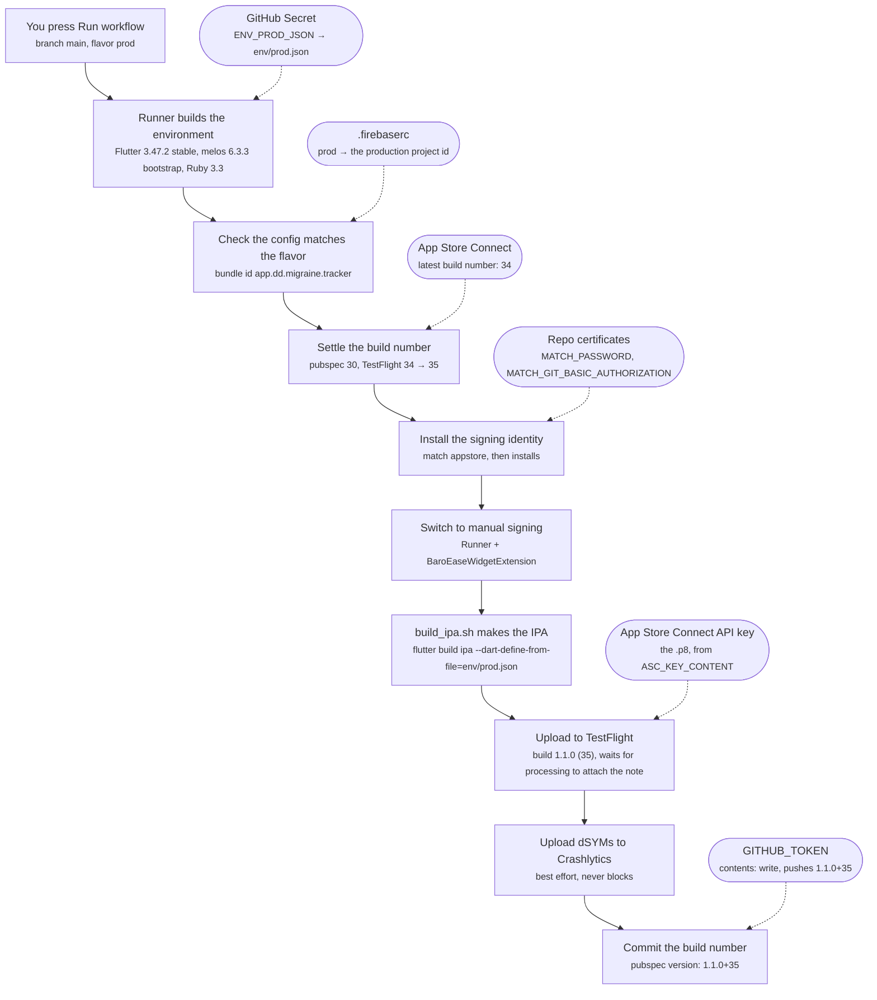

# The release pipeline — a map

What happens between pressing "Run workflow" and a build appearing in
TestFlight. This file is the map; it deliberately holds no rules.

- **Why a step is the way it is** — `docs/rules/COMMANDS.md`.
- **How each credential is made and how it fails** — `CREDENTIALS.md`, alongside.
- **What is still missing** — `docs/rules/PENDING_SETUP.md`.

Nothing here is duplicated from those on purpose: a diagram that also carries
the reasoning goes stale in a different direction from the rules it copies, and
then they disagree.

## The flow

Solid arrows are the order of execution. Dashed arrows are credentials
entering the run — every one of them comes from outside the checkout, which
is why a fresh clone alone can never produce a release.

## Where each piece lives

| Piece | File |
|---|---|
| Trigger, environment, secrets | `.github/workflows/release-ios.yml` |
| Bundle ids, targets, entitlements — what the app *is* | `ios/fastlane/Fastfile` |
| Build number, signing, export, upload, the note | `packages/script-tools/flutter/fastlane/Fastfile` |
| Which certificate and profiles | `ios/fastlane/Matchfile` |
| The build itself | `packages/script-tools/flutter/build_ipa.sh` |

## The orderings that are not arbitrary

**The build number is settled before the build, and committed after the
upload.** Before, because a number App Store Connect will refuse should cost
seconds rather than a full build. After, because a bump commit with no build
is a gap in the numbering, while a build on TestFlight whose number is in no
commit is the thing the rule exists to prevent.

**Signing is switched to manual inside the runner's checkout only.** That
checkout is thrown away, so the edit never reaches git and a developer's Mac
keeps automatic signing.

**Ruby is pinned before `bundle install`.** fastlane is a gem, and a gem
binary only runs under the Ruby it was installed for. The pin plus the Gemfile
is what keeps a runner-image update from re-tooling a release without anyone
choosing it.

**The "What to Test" note travels as `localized_build_info`, never as
`changelog`.** Both reach the same field, but `changelog` only PATCHES the beta
localizations a build ALREADY has — and a build just uploaded has none, since
App Store Connect creates them during processing. The loop runs zero times,
raises nothing, and pilot still logs "Successfully set the changelog for
build": every build shipped with an empty note and a green lane. Naming the
locale outright is what makes pilot create the localization instead of needing
one to exist. Waiting for processing (`skip_waiting_for_build_processing:
false`) is the price of that, and it is why the note costs macOS minutes.

## What runs where

The lane itself is shared — it lives in the design system and every app
embedding it runs the same four lanes, told what the app is by one
`sd_ios_app(...)` call in `ios/fastlane/Fastfile`. It runs the same
`packages/script-tools/flutter/build_ipa.sh` a developer runs by hand. Fastlane
adds signing, the export options and the upload around it — it never archives
anything itself, and `docs/rules/COMMANDS.md` says why that is not negotiable.
