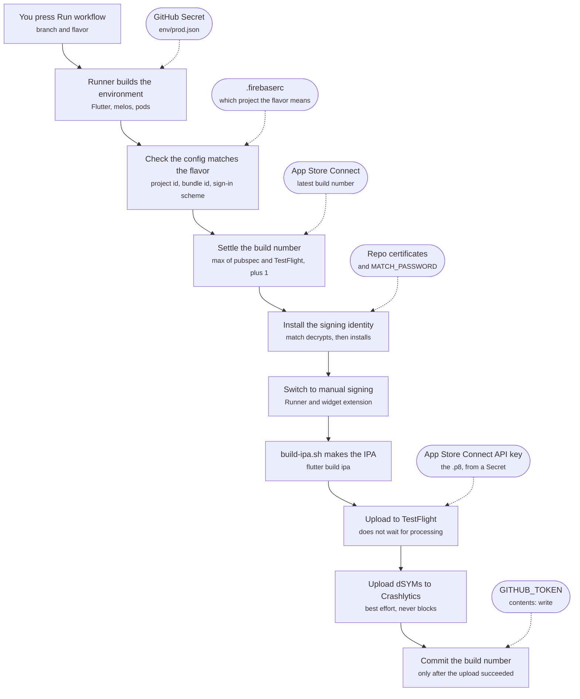

# The release pipeline — a map

What happens between pressing "Run workflow" and a build appearing in
TestFlight. This file is the map; it deliberately holds no rules.

- **Why a step is the way it is** — `docs/rules/COMMANDS.md`.
- **How each credential is made and how it fails** — `CREDENTIALS.md`, alongside.
- **What is still missing** — `docs/rules/PENDING_SETUP.md`.

Nothing here is duplicated from those on purpose: a diagram that also carries
the reasoning goes stale in a different direction from the rules it copies, and
then they disagree.

## The flow

Solid arrows are the order of execution. Dashed arrows are credentials
entering the run — every one of them comes from outside the checkout, which
is why a fresh clone alone can never produce a release.

## Where each piece lives

| Piece | File |
|---|---|
| Trigger, environment, secrets | `.github/workflows/release-ios.yml` |
| Build number, signing, export, upload | `ios/fastlane/Fastfile` |
| Which certificate and profiles | `ios/fastlane/Matchfile` |
| The build itself | `packages/system_design/tool/build-ipa.sh` |

## The orderings that are not arbitrary

**The build number is settled before the build, and committed after the
upload.** Before, because a number App Store Connect will refuse should cost
seconds rather than a full build. After, because a bump commit with no build
is a gap in the numbering, while a build on TestFlight whose number is in no
commit is the thing the rule exists to prevent.

**Signing is switched to manual inside the runner's checkout only.** That
checkout is thrown away, so the edit never reaches git and a developer's Mac
keeps automatic signing.

**Ruby is pinned before anything runs `pod`.** CocoaPods is a gem, and a gem
binary only runs under the Ruby it was installed for. Pods installed with the
image's Ruby and a job pinned to another one leave `pod` unable to load itself
— which Flutter reports as a skipped step, not as a failure, and the archive
then goes missing the `health` plugin's pods.

**The "What to Test" note is passed twice, as `changelog` AND as
`localized_build_info`.** `skip_waiting_for_build_processing: true` keeps the
lane off a 10–20 minute macOS bill, and pilot reads `changelog` — that key
specifically — to decide whether to wait for the build to appear at all. But
`changelog` alone then lands in a code path that writes the note into the beta
localizations the build ALREADY has, and a build fetched the instant it
appears has none: App Store Connect creates them during processing. The loop
runs zero times, raises nothing, and pilot still logs "Successfully set the
changelog for build" — so every build shipped with an empty note and a green
lane. `localized_build_info` names the locale outright, which is what makes
pilot create the localization instead of needing one to exist. Neither key
alone works; drop either and the note silently disappears again.

## What runs where

The lane runs the same `packages/system_design/tool/build-ipa.sh` a developer
runs by hand. Fastlane adds signing, the export options and the upload around
it — it never archives
anything itself, and `docs/rules/COMMANDS.md` says why that is not negotiable.
